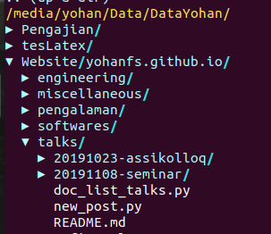

Vim
===================================================================================================

.. contents:: Daftar Isi

Basic Vim
---------------------------------------------------------------------------------------------------

- Edit File/Buat File Baru

::

        vim filename.ext

- Mode Vim
    * Insert: ketik i
    * Normal: esc

- *Command*

=========================================== =======================================================
*Command*                                       *Syntax*
=========================================== =======================================================
save                                            :w
save dan quit                                   :wq
quit                                            :q
quit tanpa buffer                               :q!
pindah ke baris (awal)                          0
running Python di Vim                           :w !python3
set current directory                           cd
memunculkan nomor baris                         :set number
delete line dari line-x ke line-y               :nomorawal, nomorakhird (contoh = :4,20d)
copy line-x sd line-y dan paste di line-z       :noAwal, noAkhir, paste in line-z (contoh 20,30t50)
move line                                       using delete (dd), kemudian tekan p di line baru
move cursor satu kata ke depan                  w
move cursor satu kata ke belakang               b
indent line dari line-x ke line-y               :nomorawal, nomorakhir> (controh = :4,20>)
memperbanyak character sebanyak n kali          (Insert mode) - (enter) Esc (enter) 90. (enter) 
wrapping column sebanyak 90 characters           :set textwidth=90
format paragraf (text width)                    gqip
buka file di tab yang baru                      t 
delete semua contents                           gg + dG 
kopi semua line                                 gg +  "\*y + G
page down                                       CTRL + f
page up                                         CTRL + b
=========================================== =======================================================
        
**Referensi**

- `about: vim <https://www.vim.org/about.php>`_
- `linuxhint: vim basics tutorial <https://linuxhint.com/vim_basics_tutorial/>`_
- `thefrugalcomputerguy: Vim <https://thefrugalcomputerguy.com/linux/seriespg.php?ser=10002>`_

Vimrc
---------------------------------------------------------------------------------------------------

Vimrc adalah sebuah file yang berfungsi untuk konfigurasi Vim. Misalnya untuk mengatur plugin dan tampilan editor.

Lokasinya berbeda tergantung sistem operasi dan Terminal yang digunakan.

**Windows**

::

        C:\Users\username\.vim\.vimrc

**Git Bash**

::

        C:\Program Files\Git\etc\vimrc

Ada hal yang aneh yang saya belum pahami apabila menggunakan Vim di Git Bash. Sepertinya
git bash menggunakan konfigurasi vimrc di kedua lokasi di atas secara bersamaan. Saat ini,
plugin diinstall di ``C:\Users\username\.vim\.vimrc``. Sedangkan konfigurasi lainnya,
misalnya pengaturan *line number* dilakukan di ``C:\Program Files\Git\etc\vimrc``.

Berikut ini adalah isi vimrc yang saya gunakan:

**.vimrc**

::

        
        set shell=/bin/bash
        packloadall
        syntax on

        let g:livepreview_previewer = 'mupdf'

        let g:netrw_keepdir=0

**vimrc**

::

        set number
        set tw=80

Install Vim Plugin
---------------------------------------------------------------------------------------------------

Install vim plugin tanpa pathogen, vundle, vim-plug, dll di Vim versi 8 ke atas. 

- add packloadall ke .vimrc (buat file ini jika belum tersedia)

::

    set shell=/bin/bash
    packloadall
    syntax on

- buat sebuah direktori ~/.vim/pack/plugins/start

::

    mkdir -p ~/.vim/pack/plugins/start

- Simpan file plugin di folder ``start``   

  * Download dan simpan secara manual 
  * clone repositori repo 

Contoh syntax:

::

    git clone https://github.com/repo ~/.vim/pack/plugins/start/repo

Syntax tersebut artinya adalah clone sebuah direktori dan simpan file tersebut di folder
``start``.       

**Referensi**

- `Youtube AJ ONeal: How to install any Vim plugin with Vim 8+ Packages <https://www.youtube.com/watch?v=XIxsD7l4zww)>`_

Plugin: Nerdree
---------------------------------------------------------------------------------------------------

Nerdtree adalah sebuah *explorer* untuk *browsing files*. Nerdtree memiliki fungsi yang sama dengan Netrw. Contoh tampilan Nerdtree adalah:

Install di Vim 8+ adalah:

::

        git clone https://github.com/preservim/nerdtree.git ~/.vim/pack/plugins/start/nerdtree

*Basic commands*-nya adalah:

- open  Nerdtree= ``:NERDTree``
- close Nerdtree= ``:NERDTreeClose``
- menu= ``m``
- set *working directory* pada *node* yang dipilih= ``cd`` 

**Referensi**

- `github preservim/nerdtree <https://github.com/preservim/nerdtree>`_
- `A vim plugin you should know <https://catonmat.net/vim-plugins-nerdtree-vim>`_

Plugin: Latex Live Preview
---------------------------------------------------------------------------------------------------

Plugin latex live preview berfungsi untuk menampilkan preview dari dokumen latex.

Cara install-nya adalah:

- download plugin dari `website ini <https://www.vim.org/scripts/script.php?script_id=4524>`_
- simpan plugin di folder start: ``~/.vim/pack/plugins/start`` 

Selanjutnya, untuk preview dokumen dibutuhkan pdf reader, misalnya menggunakan ``mupdf``.
*Software* tersebut dapat didownload dari `download mupdf <https://wiki.ubuntuusers.de/MuPDF/>`_
. Install di ubuntu bisa mengikuti langkah berikut:

::

    sudo apt-get install mupdf

Add *script* berikut ke ~/.vimrc

::

    let g:livepreview_previewer = 'mupdf'

Selanjutnya file tex dapat diedit dan ditampilkan *preview* hasil *compile* dengan cara:

::

        vim filename.tex

::

        preview: LLPStartPreview

**Referensi**

- `Live preview of latex in Vim <https://www.topbug.net/blog/2013/06/13/live-preview-of-latex-in-vim/>`_

Plugin: Netrw
---------------------------------------------------------------------------------------------------

Netrw adalah sebuah plugin vim yang berfungsi untuk *browsing* file. Fungsi ini mirip seperti File Explorer. 

Netrw dapat digunakan dengan cara membuka terminal di direktori yang dituju, kemudian vim. Selanjutnya tekan command= :Ex. Apabila telah *browsing* pada direktori tertentu, kemudian hendak keluar dari Netrw, maka *working direktory* akan tetap pada direktori awal. Dikarenakan saya ingin ketika telah *browsing*, *working directory*-nya adalah direktori terakhir, maka diperlukan *script* tambahan di ~./.vimrc sebagai berikut:

::

        let g:netrw_keepdir=0

Selanjutnya dengan command= :sh, terminal akan dijalankan pada direktori terakhir.

**Referensi**

- `Stackoverflow: update current working directory after vim netrw exit <https://stackoverflow.com/questions/15469098/update-current-working-directory-after-vim-netrw-exit>`_

Plugin: Snippets
---------------------------------------------------------------------------------------------------

**Install**

::

        git clone https://github.com/SirVer/ultisnips.git  ~/.vim/pack/plugins/start/ultisnips

Tambahkan line berikut ke ~/.vimrc

::

    let g:UltiSnipsExpandTrigger="<tab>"
    let g:UltiSnipsJumpForwardTrigger="<c-b>"
    let g:UltiSnipsJumpBackwardTrigger="<c-z>"
    let g:UltiSnipsEditSplit="vertical"

**Edit Snippets**

- Cara 1 :
    * ketik *command* = :UltiSnipsEdit
- Cara 2 :
    * buka ~/.vim/UltiSnips/tex.snippets
- syntax snippets:

::

    snippet keyword "description" option
    content
    endsnippet

Contoh:

::

    snippet eq "equation" b
    \begin{equation}

    \label{eq:}
    \end{equation}
    endsnippet

**Referensi**

- `UltiSnips Screencast Episode 2 <https://www.sirver.net/blog/2012/01/08/second-episode-of-ultisnips-screencast/>`_
- `Productivity Booster: UltiSnips <https://yufanlu.net/2016/10/30/ultisnips/>`_

Plugin: Lightline
-------------------------------------------------------------------------------------------

Lightline berfungsi untuk memberikan status atau mode masukan untuk Vim. Misalnya
menunjukkan status NORMAL atau INSERT. 

- Github repository: `di sini`_
- Install: 

::

        git clone https://github.com/itchyny/lightline.vim ~/.vim/pack/plugins/start/lightline

.. _di sini: https://github.com/itchyny/lightline.vim

Plugin: Tmux
-------------------------------------------------------------------------------------------

Tmux adalah terminal multiplexer. 

**Install Tmux di Git Bash Windows**

- Install `msys2 package`_ dan jalankan bash shell
- Install Tmux dengan *command*: ``pacman -S tmux``
- Go to direktori msys2, misalnya di ``C:\msys64\usr\bin``
- Kopi tmux.exe dan msys-event-2-1-7.dll ke direktori Git, misalnya: ``C:\Program Files\Git\usr\bin
- Buka git bash, dan ketik ``tmux`` untuk memakai tmux

**Basic Syntax**

*Syntax* untuk mengatur sesi. 

================================================== =================================
Task                                                Command
================================================== =================================
membuat sesi dan attach                             $ tmux
daftar sesi                                         $ tmux ls
attach                                              $ tmux attach
kill sesi                                           $ tmux kill-session
================================================== =================================

*Syntax* di dalam tmux

================================================== ====================================
Task                                                Command
================================================== ====================================
berpindah antar panel                               $ CTRL + B + arrow
membuat shell terminal yang baru                    $ CTRL + B + C
berpindah antar shell terminal                      $ CTRL + B + N
berpindah ke shell berikutnya                       $ CTRL + B + n
berpindah ke shell sebelumnya                       $ CTRL + B + p
close panel                                         $ CTRL + B + x
split windows secara horizontal                     $ CTRL + B + " 
split windows secara vertikal                       $ CTRL + B + %
================================================== ====================================

.. _msys2 package: https://www.msys2.org/

Vim di WSL
---------------------------------------------------------------------------------------------------

`WSL`_  adalah *windows subsystem for linux*. Secara sederhana, ini adalah terminal ubuntu yang tersedia di Windows.

Untuk menjalankan bisa dengan membuka Start kemudian pilih ubuntu. Cara lain adalah dengan mengetikkan `command`:

:: 

    WSL

Di dalam Terminal ubuntu ini, Vim editor tersedia. Bisa dibuka dengan *command*:

::

    vim .

Selanjutnya, vim bisa dicustom dengan menginstall plugin. Beruntung konfigurasi plugin bisa dikopi dari konfigurasi orang lain. Misalnya dari `amix github`_

::

    git clone --depth=1 https://github.com/amix/vimrc.git ~/.vim_runtime
    sh ~/.vim_runtime/install_awesome_vimrc.sh

.. _WSL: https://en.wikipedia.org/wiki/Windows_Subsystem_for_Linux
.. _amix github: https://github.com/amix/vimrc

